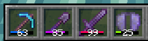

# Durability Visibility Options

A large number of settings for the visual appearance of the durability bar!

## Features
 - Bar/Percents visibility settings
 - Bar/Percents color settings
 - Bar/Percents position settings
 - Hide Bar/Percents depending on durability
 - Huge Armor HUD customization (~~13 options!~~)

## Durability Examples

## Armor HUD Examples

## Dependencies
 - [Cloth Config](https://modrinth.com/mod/cloth-config)